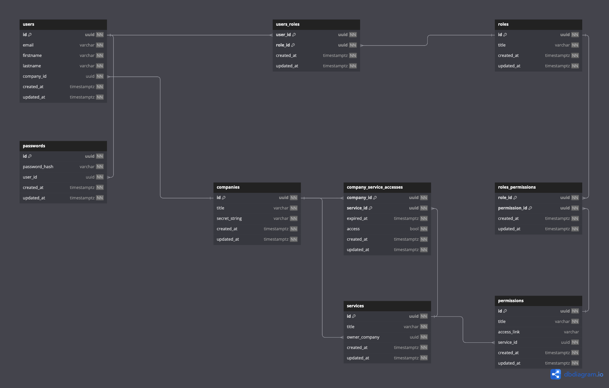

# Backend for SSO authorization and project management.🚪🔑

### Description
This is a service written in NestJS for project and company management. Includes SSO authorization. It can create companies and services, register users, and grant access to both companies and users. create custom roles and give them access to the api.

------------
### Stack

------------
### Bootstrap
You will need the installed tools to run:
- NodeJS (lts)
- Docker
- pnpm

Before starting, make sure that all the tools are prepared.

To launch the application, you need to do the following steps:
1. Copy the .env.example file to the same directory named .env;
	(optional: Edit the variables to suit your needs. We recommend setting your own values for SMTP_LOGIN and SMTP_PASSWORD to make sending emails work)
2. Create the docker containers required for the application to work with the command:
	`docker-compose up --build`;
3. Install dependencies: `pnpm i`;
4. Run the application with the command:
	`pnpm run start:dev`

------------
### Documentation
#### OpenAPI:
The OpenAPI documentation is generated automatically and is available after the application is launched at the url: http://HOST:PORT/api/docs/development/
When logging in, the browser will ask for the username/ password specified in the file.env in variables: DOCS_USER and DOCS_PASS (see .env.example file)

#### DataBase diagram:
The database diagram was created with the help of dbdiagram.io and exported in png format.
To access the dbdiagram.io write to the author of the repository

------------
### Test
##### Lanch commands
Unit tests: `pnpm run test`
e2e tests: `pnpm run test:e2e`
test coverage: `pnpm run test:cov`

### Stay in touch
Author - MoreWiktor
- Email - <morewiktor@yandex.ru> (Please add the line "sso.back". Email sorting is configured.)
- TG - [@MoreWiktor](https://t.me/morewiktor)
